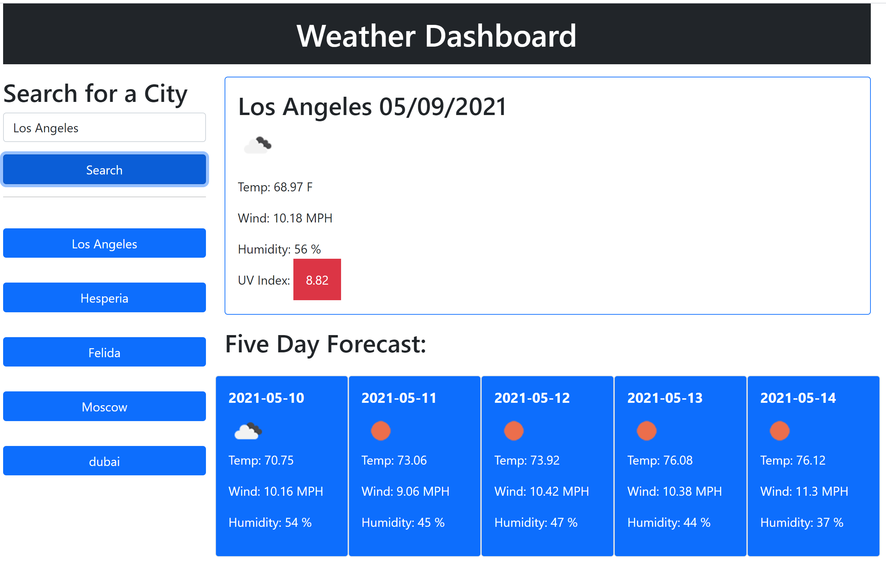

# Week06-Weather-Dashboard

A weather dashboard that allows users to select a city to see a current and five day forecast, as well as pull up historical searches from prior sessions.

## Expected Behavior

* When user searches for a city, they are presented with a current and fiveday forecast for that city.

* Previous searches are stored in local storage and are persistant from session to session, and available via button clicks

* Current weather conditions include: city name, date, an icon representation of the weather, temperature, humidity, wind speed, and UV index.

* The UV index is highlihted depending on the conditions: red = severe, blue = moderate, green = favorable.

* A five day forecast for the chosen city will display the following fields: date, icon representation of the weather, temperature, wind speed, and humidity.

## Link to deployed application

[GitHub](https://fett-boba.github.io/Week06-Weather-Dashboard/) https://fett-boba.github.io/Week06-Weather-Dashboard/

## Assets

---
